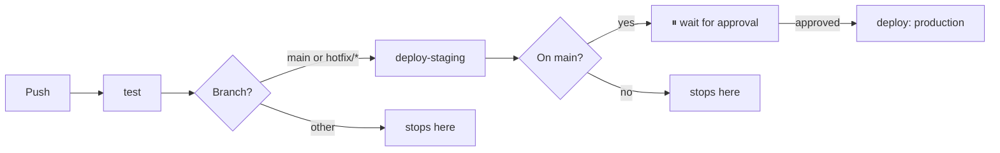

# Northwind Design Studio

A small creative agency's internal SaaS platform — three designers, one developer, deploys that used to mean dragging files over FTP and breaking something roughly weekly. This repo is the replacement: a real Node.js application shipped through a proper CI/CD pipeline, with a genuine staging environment and a manual approval gate protecting production.

**Production:** https://northwind-design.online
**Staging:** https://staging.northwind-design.online *(password-protected — internal testing only)*

---

## Features

- Google OAuth login (Passport.js) — no local password storage
- Stripe checkout in test mode
- Dark/light mode toggle, persisted per session
- Protected dashboard (session-gated)
- Contact form and marketing pages

## Tech Stack

| Layer | Choice |
|---|---|
| Runtime | Node.js 22 |
| Framework | Express + EJS |
| Auth | Passport.js (Google OAuth) |
| Payments | Stripe (test mode) |
| Testing | Jest |
| Process manager | pm2 |
| Reverse proxy | nginx |
| TLS | Let's Encrypt / certbot (auto-renewing) |
| Hosting | AWS EC2 (Ubuntu) |
| DNS | AWS Route 53 |
| CI/CD | GitHub Actions |

## Architecture

```
Browser
   │
   ▼
nginx (reverse proxy, TLS termination)
   │  proxy_pass → localhost:3000
   ▼
Express app (Node.js, managed by pm2)
   │
   ├── Passport.js ──▶ Google OAuth
   └── Stripe SDK   ──▶ Stripe Checkout (test mode)
```

nginx terminates HTTPS and forwards plain HTTP internally to the app on port 3000 — the app itself never handles TLS or binds a privileged port directly. Production and staging are two fully independent copies of this same stack, on separate EC2 instances, with separate domains, certificates, and credentials.

## CI/CD Pipeline

Every push runs tests. Every push to `main` (or a `hotfix/*` branch) deploys to staging automatically. Production only ever deploys from `main`, and only after a human explicitly approves it.



**Why a hotfix path exists:** a genuine emergency shouldn't have to choose between "skip testing entirely" and "wait for a full merge to `main`." Any branch named `hotfix/*` gets the same test-and-staging treatment as `main`, without needing a merge first — but it still cannot reach production on its own. That path stays locked to `main`, with the approval gate, no matter what a branch is named.

## Branching Strategy

Trunk-based — short-lived feature branches, merged back to `main` quickly, no long-lived parallel branches. Chosen deliberately for a team this size (3 designers, 1 developer) making frequent, small changes rather than large, infrequent releases.

## Environments

| | Production | Staging |
|---|---|---|
| URL | northwind-design.online | staging.northwind-design.online |
| Access | Public | Basic-auth restricted (team only) |
| Deploys from | `main`, after manual approval | `main` or any `hotfix/*` branch, automatically |
| OAuth credentials | Separate Google OAuth client | Separate Google OAuth client |

## Local Development

**Prerequisites:**
```bash
node --version   # this project targets Node 22
npm install
```
A `.env` file is required (never committed — see `.env.example` for the full variable list).

**Running it:**

| Command | When to use it |
|---|---|
| `npm start` | Standard local run |
| `node server.js` | Same as above, bypassing npm directly |
| `npx nodemon server.js` | Local development — auto-restarts on file changes |
| `pm2 start server.js --name northwind` | Production/staging only — not for local dev |

**Testing:**
```bash
npm test
```

## Security Notes

- No secrets are ever committed — all credentials live in GitHub Secrets (CI) or a gitignored `.env` (servers)
- Staging and production use entirely separate OAuth credentials and session secrets
- Staging is access-restricted via nginx basic auth
- Production deploys require explicit manual approval, configured as a GitHub Environment protection rule
- SSH access is key-only; password authentication is disabled

## Project Structure

```
northwind-design-studio/
├── .github/workflows/ci.yml   # test → staging → approval → production
├── config/                    # Passport, Stripe, pricing config
├── middleware/                 # auth guards
├── routes/                    # auth, checkout
├── views/                     # EJS templates
├── public/                    # CSS, client-side JS (theme toggle)
├── tests/                     # Jest test suites
└── CLAUDE.md                  # scope guardrails for AI-assisted scaffolding
```
